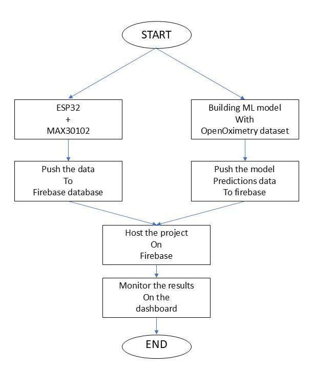
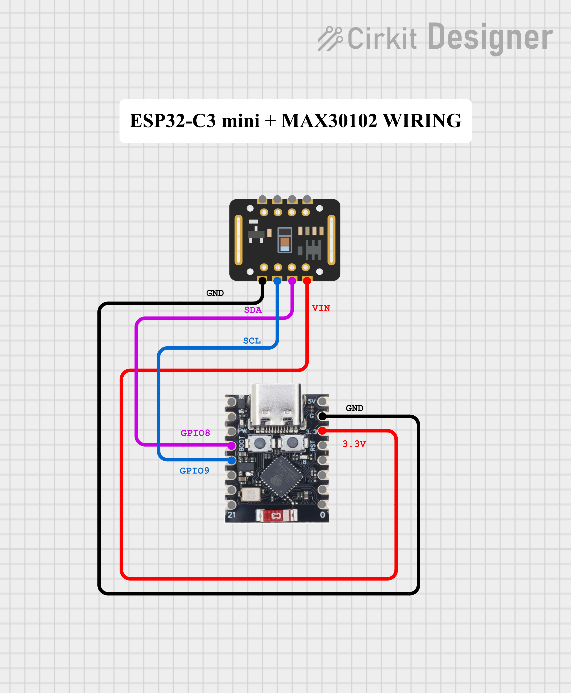

# Hypoxemia and Stress Monitoring System

## Abstract

I believe in the potential of IoT-based health monitoring systems, where our health can be seamlessly tracked and shared with our loved ones.  
For example, a small 10-year-old boy’s health can be remotely monitored by his parents while he is at school or elsewhere. Similarly, elderly people can be continuously monitored, providing peace of mind to their families.

With this motivation, I developed a **Hypoxemia and Stress Monitoring System** using an **ESP32 microcontroller** and the **MAX30102 sensor**. The collected data is sent to **Firebase**, enabling real-time remote monitoring.  
Later, I extended the project with **machine learning models** to predict **Hypoxemia** and **Stress levels** from the recorded data.Later on we will host the firebase app to see the results on a dashboard.

---

## Project Description

- **Hardware**: ESP32, MAX30102 (SpO2 & heart rate sensor).
- **Cloud**: Firebase Realtime Database for storing and retrieving health data.
- **ML Models**:
  - **Hypoxemia Prediction**: Detects low oxygen saturation events.
  - **Stress Prediction**: Estimates stress levels from PPG-derived features.

The system allows health data to be accessed and monitored remotely via dashboards or mobile apps.

---

## Project flowchart

Below is the simple flowchart of the project.

---

## Features

- Real-time **SpO2** and **Heart Rate** monitoring.
- Data transmission from **ESP32 → Firebase**.
- Remote access to health data by family members.
- Machine Learning models for **Hypoxemia** and **Stress** predictions.
- Scalable for integration with other IoT medical devices.

---

## Circuit Diagram

Below is the wiring diagram of **ESP32-C3 Mini** with **MAX30102**:

---

## Setup Instructions

### 1. Hardware

- ESP32 Development Board
- MAX30102 Pulse Oximeter & Heart Rate Sensor
- Jumper wires, USB cable

### 2. Firmware

- Program the ESP32 with Arduino IDE or PlatformIO.
- Use libraries:
  - `WiFi.h`
  - `Firebase_ESP_Client.h`
  - `Wire.h`
  - `MAX30105.h`
  - `spo2_algorithm.h`
  - `heartRate.h`
  - `time.h`

### 3. Firebase Setup

- Create a Firebase project.
- Enable **Realtime Database**.
- Generate a `serviceAccountKey.json` for admin access.
- Update Firebase credentials in ESP32 code.

### 4. Machine Learning

- Models are trained using **scikit-learn** with data collected from MAX30102.
- Stored features include: heart rate, SpO2, perfusion index, RR intervals, etc.
- Two models provided:
  - `hypoxemia_model.pkl`
  - `stress_model.pkl`

---

## Workflow

1. ESP32 reads PPG data from MAX30102.
2. Data is sent to Firebase in real-time.
3. Python pipeline fetches data → Preprocess → Predict with ML models.
4. Results (Hypoxemia & Stress) can be displayed on a dashboard.

---

## Data Source

This project makes use of publicly available physiological data:

Fong, N., Lipnick, M., Bickler, P., Feiner, J., & Law, T. (2025).  
**OpenOximetry Repository (version 1.1.1)**. PhysioNet.  
RRID:SCR_007345. https://doi.org/10.13026/be2e-cn29

The dataset was used to build and evaluate the **Hypoxemia** and **Stress** prediction models in this project.

---

## Future Scope

- Integrate more biomedical sensors (ECG, Temperature).
- Develop a mobile app for real-time alerts.
- Extend ML models for broader disease prediction.

---

## Acknowledgements

- **Firebase** for IoT cloud backend.
- **MAX30102 sensor** for reliable PPG readings.
- **Scikit-learn** for ML model building.
- Inspiration from real-world healthcare challenges.
